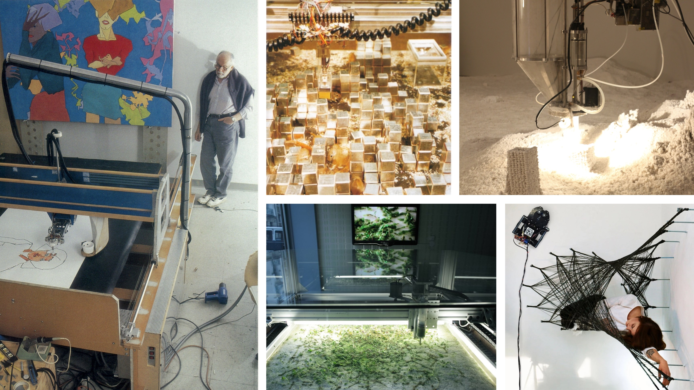

# EMAR 391.003: Creative Machines - Fall 2023

[Description](#description) | [Schedule](#course-schedule) | [Resources](#resources) | [Grading](#course-grading-policy) | [Policies](#policies) | [References](#references)

_Clockwise from left: [Harold Cohen - AARON (1972-2016)](https://computerhistory.org/blog/harold-cohen-and-aaron-a-40-year-collaboration/), [Architecture Machine Group - SEEK (1969-70)](http://worrydream.com/refs/Negroponte%20-%20Seek.pdf), [Jonathan Schipper - Detritus (2013)](https://www.jonathanschipper.com/new-page), [Maria Yablonina - Mobile Robotic Fabrication System for Filament Structures (2015)](https://www.mariayablonina.com/mobile-robotic-fabrication-system), [Allison Kudla - Capacity For Urban Eden - Human Error (2010)](
http://allisonx.com/project/capacity-for-urban-eden-human-error/)_

# Description

This course draws on skills from intermediate coursework in Emerging Media Arts. Students integrate multiple computational tools to create creative machines. Students will learn key ideas from systems art, cybernetics, and computational creativity, and apply these to the development of self-guided projects.

Final projects will demonstrate generative, interactive, and computational techniques at an advanced undergraduate level.

## Details

- **Instructor:** Dr. Robert Twomey
- **Class:** Thursday 2-4:50pm
- **Location:** CEMA 2nd floor conference room. 
- **Zoom:** [TK]
- **Office:** CEMA 253 
- **Office Hours:** Wed 2-4pm

## Learning Goals
- Learn to integrate multiple computational tools to construct creative systems. 
- Learn and apply ideas from systems art, cybernetics, and computational creativity to the development and critique of work. 
- Gain experience with identifying technologies appropriate to a project, and learning the necessary skills to put those technologies into use. 
- Learn to formulate, structure, and present independent research in computing and the arts in a formal manner.
- Think critically about creativity and technology
- Exposure to contemporary creative machines projects and practitioners.

<!-- 

- Experiential Learning
- Critical thinking and making

A student who successfully completes this course will:
- Be able to understand and critique contemporary Machine Learning (ML), Artificial Intelligence (AI),
and deep learning technologies and their consequences.
- Demonstrate a satisfactory ability to knowledgably critique and engage in a discussion about
creative work employing ML and generative art techniques.
- Be able to manage the basics of version control and software project management.
- Use online cloud-computing platforms for ML and generative arts processes.

-->

**Prequisites:** any one of the following EMAR 345 Smart Environments, EMAR 349 Machine Learning for the Arts, EMAR 342 Principles of Interactivity, or EMAR 446 Digital Fabrication and Physical Computing.

# Resources
- **Canvas:** this is where you will submit assignments, and where I will handle grading: [TK]
- **Discord:** we will use discord for informal discussion, sharing, and asynchronous support. There is a `#creative-machines` channel on the Carson Center server [TK]
  - the server invite is posted on canvas.
- **Zoom:** [TK] when necessary.

# Course Schedule
(Subject to Change-Always check back for most up to date information)

For Fall 2023 we will study Creative Machines in the context of Robotics for the first half of the semester. 

| Week | Topic |
|------|-------|
| 1 | **Introduction**   - Syllabus and Policies; Course Structure;   - identifying with machines / machine avatars   - Define terms: creativity, machines, creative machines; creative attributes   - three ways to control the XArm (demonstration, blockly, python, omniverse)   - **HW** Paper Machine |
| 2 | **Pretense**   - Small groups: share paper machines   - Plotting activity: analyze and diagram the dimensions of creative space; plot your machine;   - Pick and place with blockly + XArm   - Assign **HW2** Pick and Place   - Assign **Reading** John McCarthy _Ascribing Mental Qualities to Machines_ (1979) |
| 3 | **Strong AI, Motion Control**   - Discuss McCarthy Reading: Machine as metaphor; the project of strong AI   - Camera Robots and Dollies   - Camera mounts and camera control;   - **HW** Install Rhino Grasshopper; do tutorials. Complete Part 1 of your H3 Bot and Dolly: Robotic Camera Control | 
| 4 | **Real-Time Control and Camera Work**   - Special guest Isaac Regier (Heartland Robotics Cluster): UR-10 and grasshopper Robots plugin;   - In-class work on Robotic Camera Control |
| 5 | **Creative / Destructive Machines**   - Share and discuss Bot and Dolly homeworks   - Creative / Destructive Machines   Tooltips / end effectors   **HW** End Effectors   - Assign **Reading** Destructive Machines ([1] Tinguely, _Homage to New York_ MOMA, [2] Luria et al., _Destruction, Catharsis and Emotional Release in HRI_ (2020) | 
| 6 | **Affective Machines**   - Discuss **Reading** Destructive Machines   - Present + Discuss HW End Effectors   - Introduce Affective Machines (Picard Affective Computing; Breazeal Sociable Robots; others)   - Assign **Midterm Project** My Elegant Robot Freedom |
| 7-8 | Work time **Midterm Project**   - Independent check-in | 
| 9 | **Theories of Creativity**   - Recenter on creativity   - Brief introduction to Margaret Boden (P- and H- type creativity; combinatoric, exploratory, transformative; novelty; which of these can AI do?);   - Guiding questions for this course: What is creativity and what are its attributes? can there be such a thing as a creative machine? | - Assign **Reading** Margaret Boden _Creativity and AI_ (1998)
| 10 | **Conceptual Machines**   - Critique   - Conceptual Machines (share and discuss)   - **Reading** Conceptual Machines (Sol Lewitt _Paragraphs on Conceptual Art_)   - Assign **HW** Conceptual machine |
| 11 | **Collaboration and Co-Creation**   - Discuss **Reading** Conceptual Machines;   - Introduce Computational Co-Creativity: 4 Ps (Rhodes), 5 As (Glăveanu), 5Cs (Kantosalo and Takala)   Examples of Computational Co-Creation |
| 12 | **Desiring Machines**   - Playtest **HW** Conceptual Machines   - Introduce Desiring Machines   - Assign **Reading** Deleuze and Guattari _Balance sheet-program for desiring-machines_ (1977)   - Assign **Final Project**: your Creative Machine |
| 13 | **Healing Machines**   - Critique **HW** Conceptual Machines| 
| 14 | **Project Work and Individualized Readings**   - Readings: How to structure a project; How to write a proposal; How to pitch.  - Readings: Texts and artworks supporting individual project directions.  - Exercise: Final project development; critiques; reading responses |
| 15 | **Exhibition/Showcase**: Project completion time   -Preparing final report   -Final critiques; Open Studios. |
| Finals | Submit final documentation and report. |

# Course Grading Policy

## Graded activities
- 25% Weekly Exercises – approximately 10 exercises 
- 25% Midterm Project* - proposal, code, documentation, and results must be submitted for credit. 
- 40% Final Project* - proposal, code, documentation, presentation. 
- 10% Participation

*Work will be evaluated on the quality of concept, the degree of experimentation (both aesthetic and technical), and final realization (again, aesthetic and technical). Prompts and rubrics will be provided with more specific details regarding each assignment and breakdowns.

## Description of Assignments and Exams

__*Weekly Exercises*__
Regular small assignments employing tools, techniques, and ideas covered in class. These are short activities with clearly stated creative prompts and technical requirements. Projects will be graded on satisfactory completion with additional credit for creative, technical, expressive extension beyond requirements.

__*Projects*__
We will have one (or more) projects covering concepts from the introductory portion of the class. Each project will have a formal proposal; students will maintain code and design files for their work; students will document their result. Projects will be presented and critiqued in class. Documentation will be submitted for grading. 

__*Final Project, Documentation, and Presentation*__
For the end of the semester you will propose and create a self-directed Creative Machines project engaging tools, materials, and subjects from class. You may build off of examples that excited you from the course, or explore a topic of interest that we have not covered in class. The format, workflow, and submission of this project will follow the process of the midterm. In Week 15 we will have a showcase for these projects, including a short talk and exhibition of the resulting work.  

__*Participation*__
Contributions to class discussions and active participation in critiques and workshops are essential to the momentum of the course and the development of your ideas. This requires that you come to class prepared (having completed assigned reading or exercises), and ready to participate in class activities. Bring finished work for in-class crtiqiues. See the participation evaluation in the Grading Scale below for more information.

## Grading Scale
A+ = 96.67-100 | A = 93.33-96.67 | A- = 90-93.33  
B+ = 86.66-90 | B = 83.33-86.67 | B- = 80-83.33  
C+ = 76.67-80 | C = 73.33-76.67 | C- = 70-73.33  
D+ = 66.67-70 | D = 63.33-66.67 | D- = 60-63.33  
F = below 60% 

Here is a description of the kind of participation in the course that would earn you an A, B, C, etc. Your instructor may use pluses and minuses to reflect your participation more fairly, but this is a general description for each letter grade.

A – Excellent 

Excellent participation is marked by near-perfect attendance and rigorous preparation for class work. You respond to questions and activities with enthusiasm and insight and you listen and respond thoughtfully to your peers. You submit assignments on time, adhering to posted requirements, and demonstrate a thorough engagement with the assignment. You respond creatively to any feedback you receive (from both your peers and instructor). You are an active contributor to classroom community. 

  

B – Good 
Good participation is marked by near-perfect attendance and thorough preparation for class. You respond to questions with specificity and make active contributions to class. You submit assignments on time, and demonstrate a thorough engagement with the assignment. You respond effectively to the feedback you receive (from both your peers and instructor). You are a regular and reliable contributor to classroom community. 

C – Satisfactory 
Satisfactory participation is marked by regular attendance and preparation for class. You respond to questions when prompted and participate in classroom activities, though you may sometimes be distracted. You are present in class, with few absences, and have done some of the work some of the time. You submit assignments and make some efforts toward revision proposals and final submission. You are involved in classroom activities, but you offer minimal feedback and you may not always contribute fully to classroom community.

D – Unsatisfactory 
Unsatisfactory participation is marked by multiple absences from class and a consistent lack of preparation. You may regularly be distracted by materials/technology not directly related to class. You submit late or incomplete work. You are absent for classroom activities, or do not work cooperatively in collaborative environments. 

F—Failing 
Failing participation is marked by excessive absences, a habitual lack of preparation, and failure to engage in classroom activities and development processes.

# Policies

Course-specific policies and rules.

[Attendance](#attendance) | [Late Work](#late-work) | [Other People's Code](#other-peoples-code) | [UNL Course Policies and Resources](#unl-course-policies-and-resources)

## Attendance
On-time attendance is required as well as work inside and outside of section. Please notify your instructor in advance if you must be absent for illness or family emergency. Any absences must be cleared with the instructor, or justified with written documentation (e.g. letter from team, etc.). We do not differentiate between mental and physical health and in either case please be in communication for when you need to take a day off. After a student misses a week’s worth of classes each subsequent missed class will result in the reduction of the final grade by a full letter grade (i.e., A to B, B- to C-) Excessive tardiness or leaving early will also impact your grade and will follow the same rubric.

Please also note the JCSTF attendance policy:
- 4.7 Attendance Policy
- 4.7.1 After a student misses an equivalent of one week’s worth of classes, each subsequent missed
class will result in the reduction of the final grade by a full letter grade (i.e., A to B, B- to C-).
- 4.7.2 Students may be granted an excused absence at the instructor’s discretion.
- 4.7.3 Students may be granted an excused absence, at the instructor’s discretion, to allow those students to participate in extra-curricular events representing the University. In such cases, the instructor must be notified in advance.
- 4.7.4 This policy, as approved by the faculty, represents the minimum requirement. Faculty members are permitted to develop more stringent attendance requirements, as long as those requirements are detailed in writing in the class syllabus and distributed at the beginning of each course.
- 4.7.5 The policy on students who are late to class will be left up to the individual instructors.

## Late Work
An assignment may receive an F if a student does not participate in every phase of the development of the project and meet all deadlines for preliminary materials (proposals, drafts, work in progress, etc.). Failure to submit any of the graded course assignments is grounds for failure in the course. If a final draft or project, plus required addenda, is not submitted in class on the date due, it will be considered late and will lose one 5% for each day or part of a day past due (A to B, etc.). Assignments are due in class and via online submission, as specified in assignment descriptions. Any late submissions must be approved by your faculty instructor well in advance of the due date.

## Other People's Code
We will use many open source projects to make our work. It is ok to use others' code. However, **you need to cite your sources**, and **you need to do transformative work/make it your own**.

## UNL Course Policies and Resources

Students are responsible for knowing the university policies and resources found on this page ([https://go.unl.edu/coursepolicies](https://go.unl.edu/coursepolicies)):
- University-wide Attendance Policy
- Academic Honesty Policy
- Services for Students with Disabilities
- Mental Health and Well-Being Resources
- Final Exam Schedule
- Fifteenth Week Policy
- Emergency Procedures
- Diversity & Inclusiveness
- Title IX Policy
- Other Relevant University-Wide Policies

# References
[TK]
